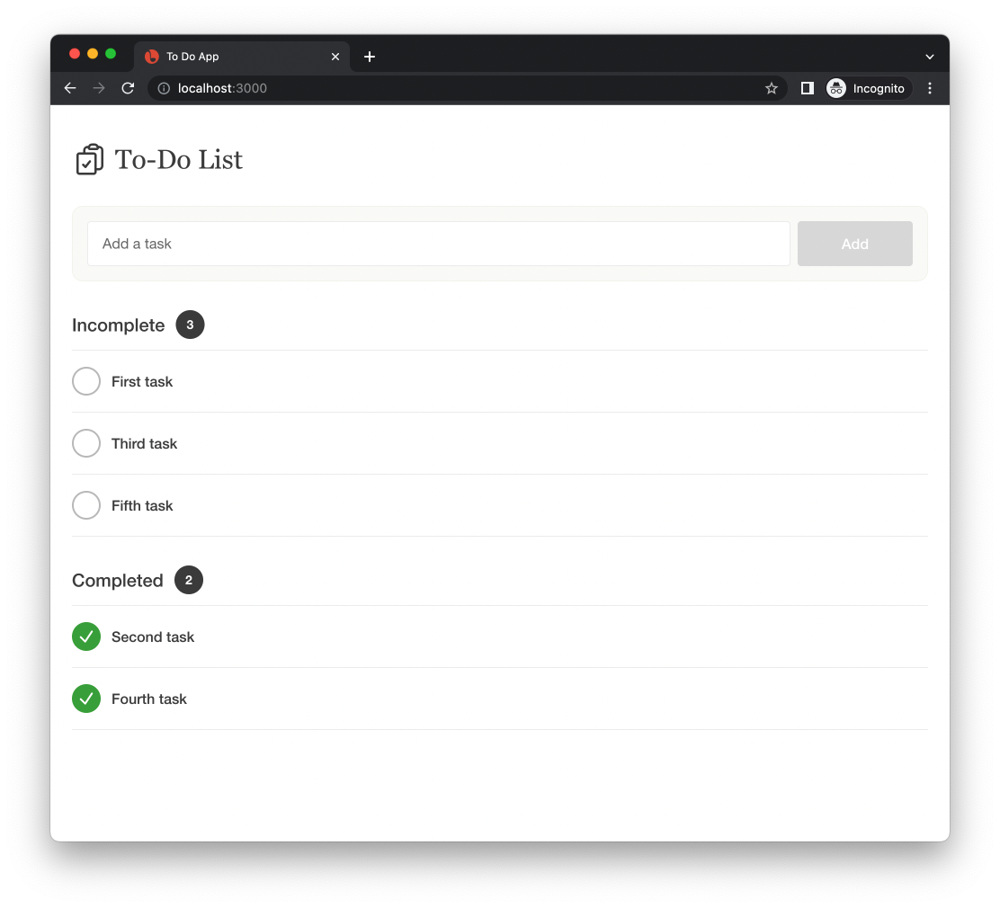
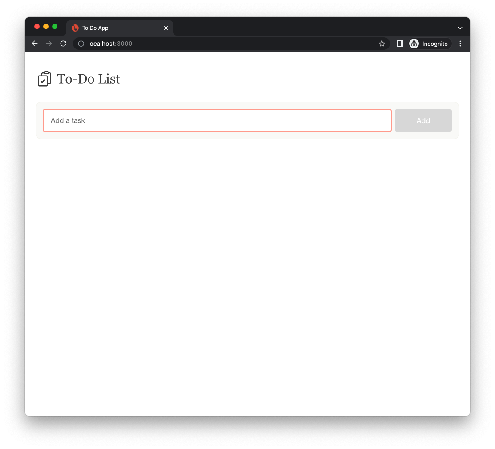
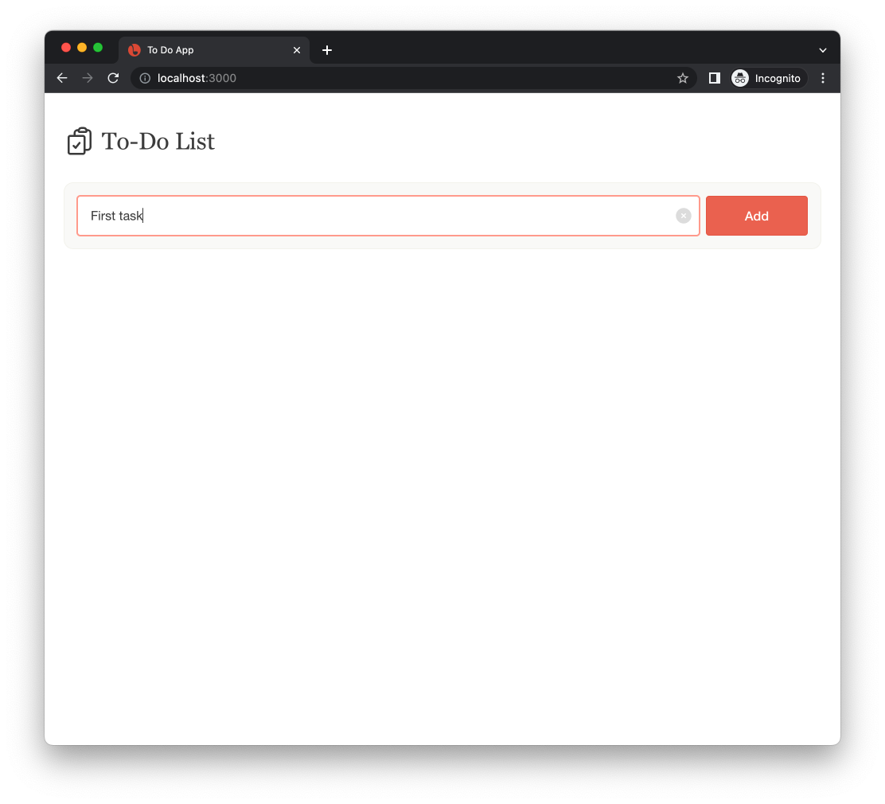
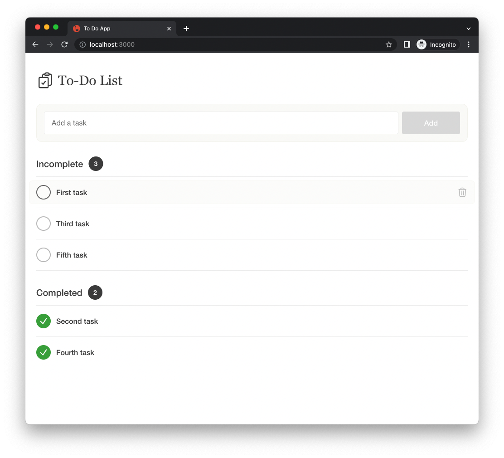
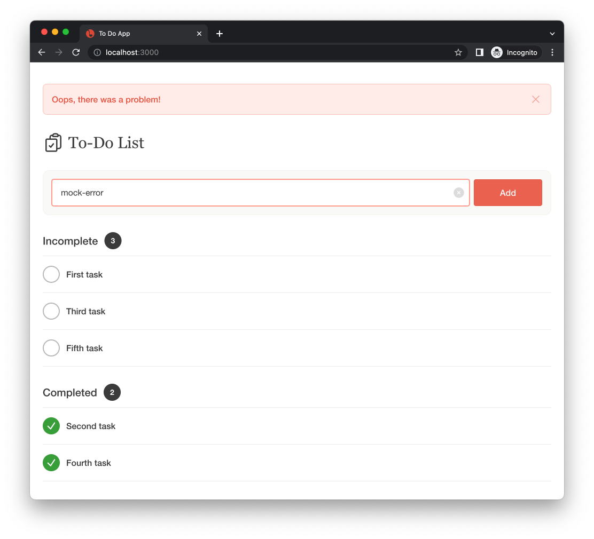

# Overview

A "To Do App" coding challenge for frontend developers at Sincere.

The starter app is a [Next.js](https://nextjs.org/) template using the built-in
support for TypeScript, ESLint, and Tailwind CSS. The application is configured
to use the legacy [Pages Router](https://nextjs.org/docs/pages) and data
fetching is expected to use React Hooks with [SWR](https://swr.vercel.app/). A
`todos` mock API is included and preconfigured using the
[MSW](https://mswjs.io/) mocking library.

Below is an example screenshot and video of the Todos app we will be building.



## Example Video

Watch the example video in `examples/todos-example.mp4`.

## Project Structure

```
public/         NextJS static files
src/
  components/   React components
  hooks/        React hooks
  lib/          Common functions and types
  mocks/        MSW mock API (no changes expected)
  pages/        Next.js pages (Page Router)
  styles/       Global CSS styling
```

## Development

**Prequisites**

- nodejs >= 16.140 (18.16.0 recommended)
- yarn >= 1.22.10

**Install**

```
yarn install
```

**Run the local dev server**

```
yarn dev
```

The application should be running at [http://localhost:3000](http://localhost:3000).

In some cases, you may have a port conflict which will be reported in the
console. The app will be running on a different port.

# Challenge

The challenge is to create a basic todo application using the starter
application codebase. The application should utilize Next.js, TypeScript,
functional React components, React Hooks, SWR, and Tailwind CSS. You are
expected to complete the list of user stories below.

Your submission will be evaluated on multiple criteria:

- Was it returned on time?
- Did you complete all of the stories?
- Does it work?
- How well is TypeScript utilized?
- Did you use functional components and hooks?
- Did you use [`useSWR`](https://swr.vercel.app/docs/api) and [`mutate`](https://swr.vercel.app/docs/mutation)?
- How accurate is the styling to the mocks? Does it look and feel good?
- How well was [Tailwind CSS](https://tailwindcss.com/docs) utilized?
- Code quality and organization.

Notes:

- UI mocks are included with each story (in the `examples` directory). While we
  do not believe in "pixel perfect", please do your best to capture the visual
  aesthetic. This includes typography, whitespace, color, etc. Everything needed
  is in the provided Tailwind config and should be replicatable. Do your best!
- The API is mocked out in developement using the [Mock Service
  Worker](https://mswjs.io/) library. Example functions for interacting with the
  API can be found in `src/lib/todos-lib.ts`. You can choose to use these or use
  your own. It behaves like a regular REST API and you should not need to alter
  the mocks unless you extend the feature set.
- **DO NOT USE SSR**. The mock API uses LocalStorage for persistence and only
  works with client-side data fetching.
- A sample hook using `useSWR` is provided in `src/hooks/useTodos.tsx`. We
  expect interaction with the API to use SWR including `useSWR` and `mutate`. If
  you are unfamiliar with SWR, please take a minute to familiarize yourself with
  [mutation](https://swr.vercel.app/docs/mutation) in the docs.
- **NO CLASS COMPONENTS**. We expect functional components using React Hooks.
- **The spec is a suggestion!** Feel free to embelish or improve the product as
  you go. Additional hover states, transistions, etc. are welcome but not
  required unless explicitly stated in stories.
- The `react-icons` package is installed for icons with a preference to
  [Heroicons 2](https://react-icons.github.io/react-icons/icons?name=hi2)
- For fonts, `font-sans` and `font-serif` should be enough.

If you are familiar with the tech stack, expect the challenge to take about 2
hours. You are free to spend as much time on the challenge as you would like –
we only require that it is returned on time.

## Returning your challenge

To return your code challenge:

1. Remove the `node_modules` directory
1. Archive your project as `.zip` or `.tar.gz` file.
1. Email your archived project to your recruiting contact. You may need to upload your archive to a file sharing service like Dropbox or Google Drive.

# Stories

### 1. As a developer, I want to use `git`

- Initialize a git repository and commit your changes incrementally.

### 2. As a user, I can create a new Todo.

> NOTE: The example mocks show a clear button inside the input. **THIS IS OPTIONAL**

- The new todo should require a title
- When the form it submitted, the new todo should appear in the Incomplete list
- The new todo item should be persisted (i.e., it is present after page reload)
- The add button should be disabled for empty input 
- The add button should be enabled when text is present 
- **OPTIONAL** There should be a way to easily clear the input.

### 3. As a user, I can view a list of Todos.

- There should be a list of Incomplete todo items including a counter
- There should be a list of Complete todo items including a counter
- Incomplete todo items have an empty checkmark
- Complete todo items have a checkmark



### 4. As a user, I can mark a Todo as complete or incomplete.

- I want to click either the circle or the todo text to toggle the status (incomplete/complete).
- The todo item should move to the appropriate incomplete/complete list when its status changes.
- There should be visual feedback that the todo is clickable (desktop users).

**See example video in `examples/todos-example.mp4`**

### 5. As a user, I can delete a Todo

- When I mouse over a todo item, I want a delete icon to appear.
- Clicking the delete icon should remove the todo item from the list and persist the change.
- Confirmation is not required.


### 6. As a user, I see an error message when something fails

> **IMPORTANT!** The mock API is configured to throw an error if the title contains `mock-error`

- I want to see an error message when there is a problem.
- I want to be able to dismiss the error message.
- I want the error message to dismiss automatically after successfully creating a new todo item.


